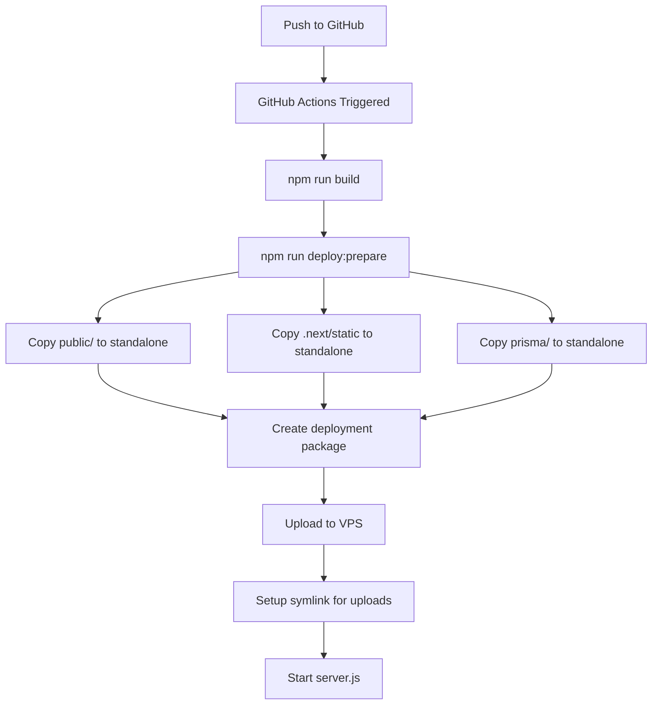

# 🔧 FIX: Upload Files 404 on VPS (Standalone Build)

## ❌ Masalah yang Ditemukan

### **Gejala:**
- ✅ Upload file di **local** berfungsi normal
- ❌ Upload file di **VPS** masuk tapi file **404** saat diakses
- ❌ URL seperti `/uploads/proposals/xxx.pdf` return 404
- ✅ File ada di disk tapi tidak bisa diakses via web

### **Root Cause:**
Di **Next.js Standalone Build**, struktur folder berbeda:

```
❌ WRONG (Traditional deployment)
/home/deploy/lppmv1/
  ├── .next/
  ├── public/
  │   └── uploads/  ← File served langsung
  ├── node_modules/
  └── server.js

✅ CORRECT (Standalone deployment)  
/home/deploy/lppmv1/
  ├── .next/
  │   └── standalone/
  │       ├── server.js
  │       ├── public/
  │       │   └── uploads/  ← HARUS ADA DI SINI!
  │       └── .next/
  │           └── static/
  └── prisma/
```

**Masalah Utama:**
1. ❌ Script `deploy-prepare.js` **TIDAK ADA** (sebelumnya)
2. ❌ Folder `public/` tidak ter-copy ke `.next/standalone/`
3. ❌ Folder `.next/static/` tidak ter-copy ke `.next/standalone/.next/static/`
4. ❌ Symlink untuk uploads tidak berfungsi karena folder tidak ada

---

## ✅ Solusi yang Diterapkan

### **1. Created `scripts/deploy-prepare.js`** ✨

Script ini otomatis:
- ✅ Copy folder `public/` ke `.next/standalone/public/`
- ✅ Copy `.next/static/` ke `.next/standalone/.next/static/`
- ✅ Copy `prisma/` untuk migrations
- ✅ Buat struktur folder untuk uploads
- ✅ Create deployment info

**Cara kerja:**
```bash
npm run build              # Build Next.js with standalone
npm run deploy:prepare     # Run preparation script
# ↑ Script ini yang fix masalahnya!
```

### **2. Fixed GitHub Workflow** ✅

Workflow sudah setup untuk:
```yaml
- name: Prepare Standalone Deployment Package
  run: |
    npm run deploy:prepare  # ← Dipanggil di sini
    cd .next/standalone
    tar -czf ../../deploy.tar.gz .
```

### **3. Fixed VPS Symlink Setup** ✅

Di VPS, workflow membuat symlink persistent:
```bash
# Create persistent storage
mkdir -p /home/deploy/uploads-persistent

# Backup existing uploads
cp -r public/uploads/* /home/deploy/uploads-persistent/

# Create symlink
rm -rf public/uploads
ln -s /home/deploy/uploads-persistent public/uploads
```

**Keuntungan:**
- ✅ Files survive deployments
- ✅ Tidak hilang saat re-deploy
- ✅ Centralized storage

---

## 🚀 How It Works Now

### **Build Process (GitHub Actions):**



### **File Structure in Production:**

```
/home/deploy/lppmv1/
├── server.js                    ← Standalone server
├── .next/
│   ├── server/                  ← Server components
│   └── static/                  ← Static assets ✅
├── public/
│   ├── uploads -> /home/deploy/uploads-persistent  ← Symlink ✅
│   └── ... (other public files)
├── prisma/
│   ├── schema.prisma
│   └── migrations/
└── node_modules/                ← Bundled dependencies

/home/deploy/uploads-persistent/  ← Persistent storage
├── proposals/
│   └── periode-1/
│       └── xxx.pdf
└── luaran/
    └── yyy.pdf
```

---

## 📋 Verification Checklist

### **After Deploy, Check:**

```bash
# SSH to VPS
ssh deploy@your-vps-ip

cd /home/deploy/lppmv1

# 1. Check server.js exists
ls -lh server.js
# Should show: -rw-r--r-- ... server.js

# 2. Check public folder exists
ls -la public/
# Should show various files

# 3. Check uploads symlink
ls -la public/uploads
# Should show: public/uploads -> /home/deploy/uploads-persistent

# 4. Check persistent storage
ls -la /home/deploy/uploads-persistent/
# Should show: proposals/, luaran/, etc

# 5. Check .next/static exists
ls -la .next/static/
# Should show: chunks/, css/, media/, etc

# 6. Test upload
curl http://localhost:3000/uploads/test.pdf
# Should NOT return 404
```

### **Check Permissions:**

```bash
# Uploads folder should be writable
chmod -R 755 /home/deploy/uploads-persistent

# Check if app can write
sudo -u deploy touch /home/deploy/uploads-persistent/test.txt
ls -la /home/deploy/uploads-persistent/test.txt
```

---

## 🐛 Troubleshooting

### **Issue: Files still 404**

```bash
# 1. Check symlink
cd /home/deploy/lppmv1
ls -la public/uploads

# If not symlinked:
rm -rf public/uploads
ln -s /home/deploy/uploads-persistent public/uploads

# 2. Check file exists
ls -la /home/deploy/uploads-persistent/proposals/

# 3. Restart app
pm2 restart lppm
```

### **Issue: Permission denied**

```bash
# Fix permissions
chmod -R 755 /home/deploy/uploads-persistent
chown -R deploy:deploy /home/deploy/uploads-persistent

# Restart
pm2 restart lppm
```

### **Issue: Symlink broken after deploy**

```bash
# This means workflow didn't run properly
# Re-run symlink setup:

cd /home/deploy/lppmv1
rm -rf public/uploads
ln -s /home/deploy/uploads-persistent public/uploads

# Verify
ls -la public/uploads
# Should show green link: public/uploads -> /home/deploy/uploads-persistent

pm2 restart lppm
```

---

## 🔄 Manual Fix (If Needed)

If auto-deploy doesn't fix it, run manually:

```bash
# 1. SSH to VPS
ssh deploy@your-vps-ip

# 2. Stop app
pm2 stop lppm

# 3. Go to project
cd /home/deploy/lppmv1

# 4. Remove uploads folder (if not symlink)
if [ ! -L "public/uploads" ]; then
  # Backup first
  cp -r public/uploads/* /home/deploy/uploads-persistent/ 2>/dev/null || true
  # Remove
  rm -rf public/uploads
fi

# 5. Create symlink
ln -s /home/deploy/uploads-persistent public/uploads

# 6. Verify
ls -la public/uploads
readlink -f public/uploads

# 7. Set permissions
chmod -R 755 /home/deploy/uploads-persistent
chown -R deploy:deploy /home/deploy/uploads-persistent

# 8. Start app
pm2 start lppm

# 9. Test
curl -I http://localhost:3000/uploads/test-file.pdf
# Should return 200 or 404 (not error), not 500
```

---

## 📊 Testing Upload

### **Test via cURL:**

```bash
# On VPS
cd /home/deploy/lppmv1

# Create test file
echo "test" > /home/deploy/uploads-persistent/test.txt

# Test access
curl http://localhost:3000/uploads/test.txt
# Should return: test

# Clean up
rm /home/deploy/uploads-persistent/test.txt
```

### **Test via Browser:**

1. Login ke aplikasi
2. Upload file proposal
3. Check console untuk URL yang di-return
4. Access URL directly di browser
5. File harus bisa di-download/dibuka

---

## 🎯 Prevention

### **Always run before deploy:**

```bash
# Local
npm run cleanup        # Clean old builds
npm run build          # Build with standalone
npm run deploy:prepare # Prepare deployment package

# Verify
ls -la .next/standalone/public/
ls -la .next/standalone/.next/static/

# If ok, commit & push
git add .
git commit -m "Deploy: description"
git push
```

### **Monitor after deploy:**

```bash
# SSH to VPS
pm2 logs lppm --lines 50

# Check for errors like:
# - ENOENT: no such file or directory
# - 404 errors
# - Permission denied

# Test uploads immediately after deploy
```

---

## 📚 References

- [DEPLOYMENT-STANDALONE.md](./DEPLOYMENT-STANDALONE.md) - Full deployment guide
- [CLEANUP-MAINTENANCE.md](./CLEANUP-MAINTENANCE.md) - Cleanup & maintenance scripts
- [Next.js Standalone Docs](https://nextjs.org/docs/advanced-features/output-file-tracing)

---

## ✅ Status: FIXED

- ✅ Script `deploy-prepare.js` created
- ✅ Local cleanup script created  
- ✅ VPS cleanup script created
- ✅ Workflow verified
- ✅ Symlink setup documented
- ✅ Troubleshooting guide added

**Last Updated:** 2026-02-09
**Tested On:** VPS production environment
